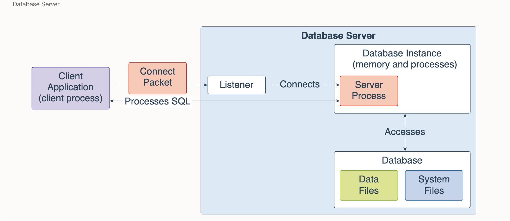

A single-instance database architecture consists of one database instance and one database.
A one-to-one relationship exists between the database and the database instance.
Multiple single-instance databases can be installed on the same server machine.
There are separate database instances for each database. This configuration is useful to run different
versions of Oracle Database on the same machine.

An Oracle Real Application Clusters (Oracle RAC) database architecture consists of multiple instances
that run on separate server machines. All of them share the same database. 
The cluster of server machines appear as a single server on one end, and end users and applications
on the other end. This configuration is designed for high availability, scalability, and high-end performance.

The listener is a database server process. 
It receives client requests, establishes a connection to the database instance,
and then hands over the client connection to the server process. The listener can run locally on
the database server or run remotely. Typical Oracle RAC environments are run remotely.
--------------------------------------------------------------------------------------
# Oracle RAC: What Happens When Multiple Instances Access the Same Data?

In **Oracle RAC (Real Application Clusters)**, multiple instances can work on the same table or even the same row at the same time. Oracle ensures **data consistency and integrity** using mechanisms like **row-level locking** and **Cache Fusion**.

---

## 1. Same Table ≠ Problem

Accessing the same table from multiple instances is completely normal.

- ✅ Different rows → No conflict → Executes in parallel
- ⚠️ Same rows → Oracle coordinates access

---

## 2. Row-Level Locking (First Line of Defense)

Oracle uses **row-level locks** by default.

### Example Scenario:
- Instance A updates **Row X**
- Instance B tries to update **Row X**

Result:
- Instance B **waits** until Instance A commits or rolls back

Prevents:
- Dirty writes
- Data corruption

---

## 3. Cache Fusion (RAC Core Mechanism)

Each RAC instance has its own memory (**buffer cache**).  
When multiple instances need the same data block:

- Oracle transfers the block **memory-to-memory** via interconnect
- No disk read is needed

 This is called **Cache Fusion** and is much faster than disk I/O

---

## 4. Block-Level Coordination

When instances modify the same data block:

- Oracle transfers **block ownership** between instances
- Managed by **Global Cache Service (GCS)**

### Block Modes:
-  **Shared Mode** → Read access
- ️ **Exclusive Mode** → Write access (only one instance allowed)

---

## 5. Contention & Performance Impact

High contention occurs when multiple instances frequently update the same data:

-  "Hot blocks"
-  Block pinging between nodes
-  Performance degradation

---

## 6. Best Practices to Avoid Contention

- Distribute writes across different rows (e.g., hashing)
- Use **partitioned tables**
- Optimize sequences (use `CACHE`, avoid `ORDER` when possible)
- Design workload to minimize cross-instance updates

---

## Analogy

Think of RAC like a shared online document:

- Multiple users (instances) can open the same file (table)
- Editing different lines → no issue
- Editing the same line → one must wait
- Changes sync instantly (Cache Fusion)

---

## Summary

- Multiple instances can safely access the same data
- Oracle ensures consistency using:
    - Row-level locking
    - Cache Fusion
    - Global Cache Service (GCS)
- Conflicts result in **waiting**, not corruption
- Heavy contention impacts **performance**, not correctness

---