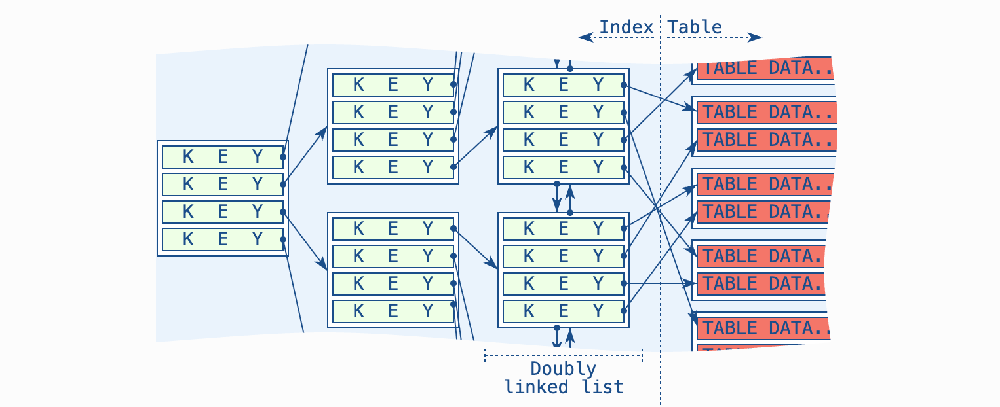
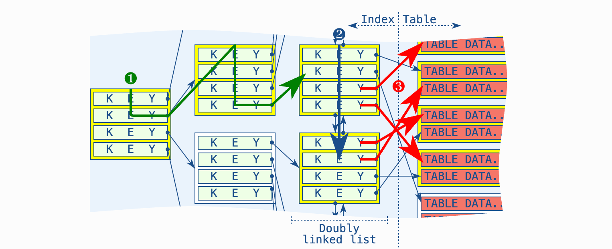
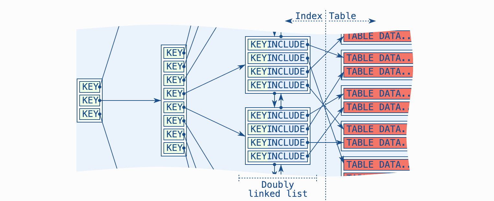

* The B-tree
* The doubly linked list at the leaf node level of the B-tree
* The table

The first two structures together form an index so 
they could be combined into a single item, i.e. the “B-tree index”.

In the general case, the database software starts traversing the B-tree to find the first matching entry
at the leaf node level (1). It then follows the doubly linked list until it has found all matching entries(2)
and finally it fetches each of those matching entries from the table (3).

The index-only scan does exactly that: it omits the table access if the required data is available in the 
doubly linked list of the index.
[1: Index](include_index.sql)(:1)

It is a common misconception that indexes only help the **where** clause.
B-tree indexes can also help the **order by**, **group by**, **select** and other clauses. 
It is just the B-tree part of an index—not the doubly linked list—that cannot be used by other clauses.

The crucial point in this example is that the B-tree index happens to have all required columns
—the database software doesn’t need to access the table itself. This is what we refer to as an index-only scan.

The example above uses the fact that the doubly-linked list—the leaf nodes of the B-tree—contains the eur_value column.
**Although the other nodes of the B-tree store that column too**, this query has no use for the information in these nodes.

**Include**

The include clause allows us to make a distinction between columns we would like to have in the entire index (key columns)
and columns we only need in the leaf nodes (include columns). That means it allows us to remove columns from the non-leaf 
nodes if we don’t need them there.
[1: Index with include](include_index.sql)(:9)

The order of the leaf node entries does not take the include columns into account.
The index is solely ordered by its key columns.

Internal nodes contain(**not-include**):
* Both a and b (because they’re part of the sorted key).
* Pointers to child pages.

Leaf nodes contain:
* Both a and b values.
* Row pointers (in PostgreSQL: TID = (block, offset) of the heap row).
Why both a and b? Because the index is sorted first by a, then by b.

Let’s also look at another case where it is beneficial to have an extra column in the index.
[1: Index with include](include_index.sql)(:15)

If we take the previous index from above, it already satisfies this requirement:
[1: Index with include](include_index.sql)(:21)

The database software can use that index with the three-step procedure as described at the beginning: 
(1) it will use the B-tree to find the first index entry for the given subsidiary; 
(2) it will follow the doubly linked list to find all sales for that subsidiary; 
(3) it will fetch all related sales from the table, remove those for which the like pattern 
on the notes column doesn’t match and return the remaining rows.

The problem is the last step of this procedure: the table access loads rows without knowing if they will 
make it into the final result. Quite often, the table access is the biggest contributor to the total 
effort of running a query. Loading data that is not even selected is a huge performance no-no.

The challenge with this particular query is that it uses an in-fix like pattern.
Normal B-tree indexes don’t support searching such patterns. However, B-tree indexes still support filtering on such patterns.
Note the emphasis: searching vs. filtering.

In other words, if the notes column was present in the doubly linked list, the database software could apply the like 
pattern before fetching that row from the table (not PostgreSQL, see below).
This prevents the table access if the like pattern doesn’t match. If the table has more columns, there is still a table 
access to fetch those columns for the rows that satisfy the where clause—due to the select *.
[1: Index with include](include_index.sql)(:26)

Unique Indexes with Include Clause
Last but not least there is an entirely different aspect of the include clause:
unique indexes with an include clause only consider the key columns for the uniqueness.
That allows us to create unique indexes that have additional columns in the leaf nodes, 
e.g., for an index-only scan.
[1: Index with include](include_index.sql)(:32)
This index protects against duplicate values in the id column,7, yet it supports an index-only scan for the next query.
[1: Index with include](include_index.sql)(:37)

credits: Markus Winand

https://use-the-index-luke.com/blog/2019-04/include-columns-in-btree-indexes