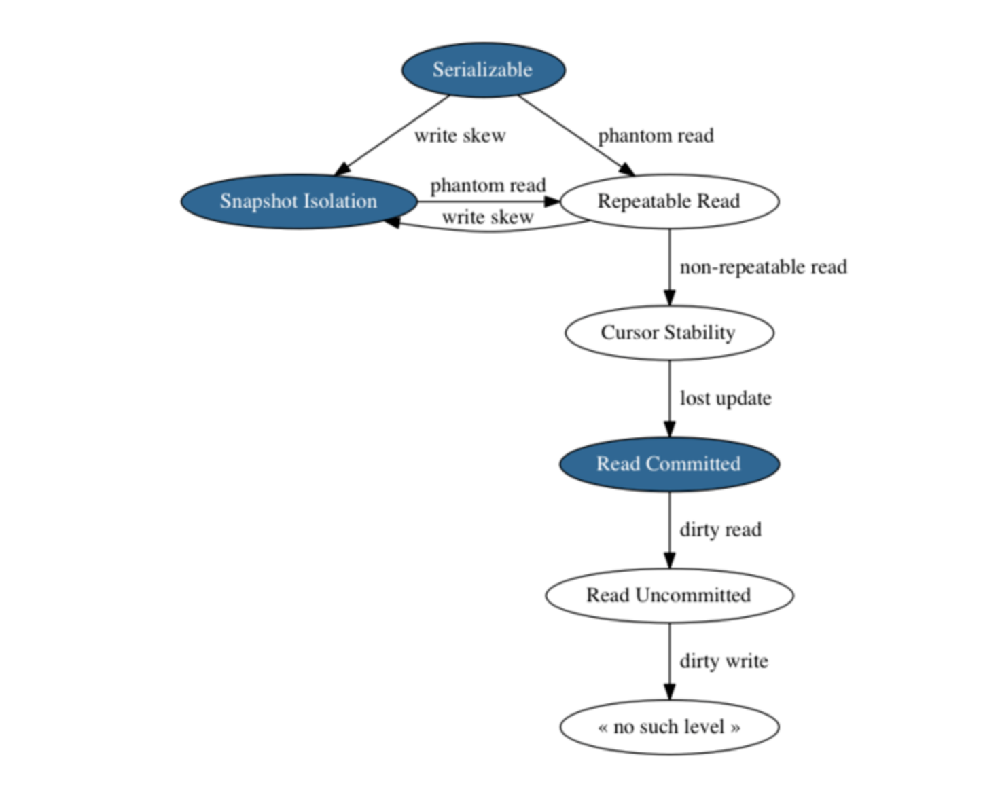
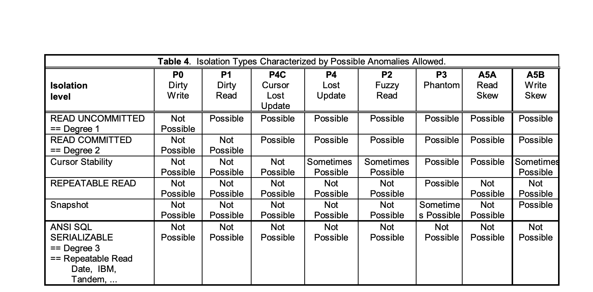

At the top, Serializable doesn’t allow any phenomena.
Following the arrows removes protection for the labeled anomaly.

The three nodes in blue are the levels actually offered by PostgreSQL.
What’s confusing is that the SQL spec recognizes a limited number of levels,
so PostgreSQL maps the names from the spec to the actual levels supported:

What you ask for	What you get
Serializable	    Serializable
Repeatable Read	    Snapshot Isolation
Read Committed	    Read Committed
Read Uncommitted	Read Committed

[1: Repeatable read](isolation_level.sql)(:1)

Pessimistic concurrency control takes locks on database rows to force transactions to wait their turn reading and writing.
It is “pessimistic” because it always takes the time to acquire and release locks, assuming gloomily that there will be contention.

Optimistic control doesn’t bother taking locks, it just puts each transaction into a separate snapshot of the database 
state and watches for any contention to happen. If one transaction interferes with another,
the database halts the offender and erases its work. This ends up being efficient when interference is rare.

In PostgreSQL, two levels use optimistic concurrency control: 
the repeatable read (which is actually snapshot isolation) and serializable levels.

For example, we can prevent lost updates in a read committed transaction by taking a lock 
on the row between reading and updating it. Just add “FOR UPDATE” to the select statement.

[1: Isolation](isolation_level.sql)(:8)

